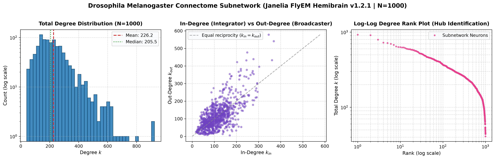
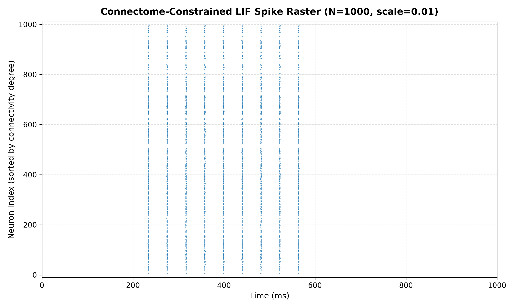
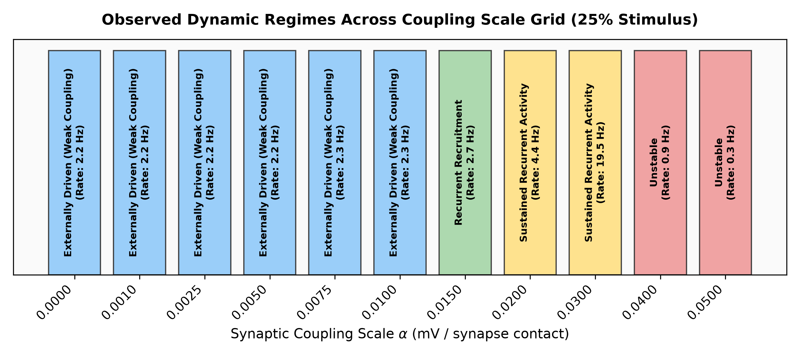
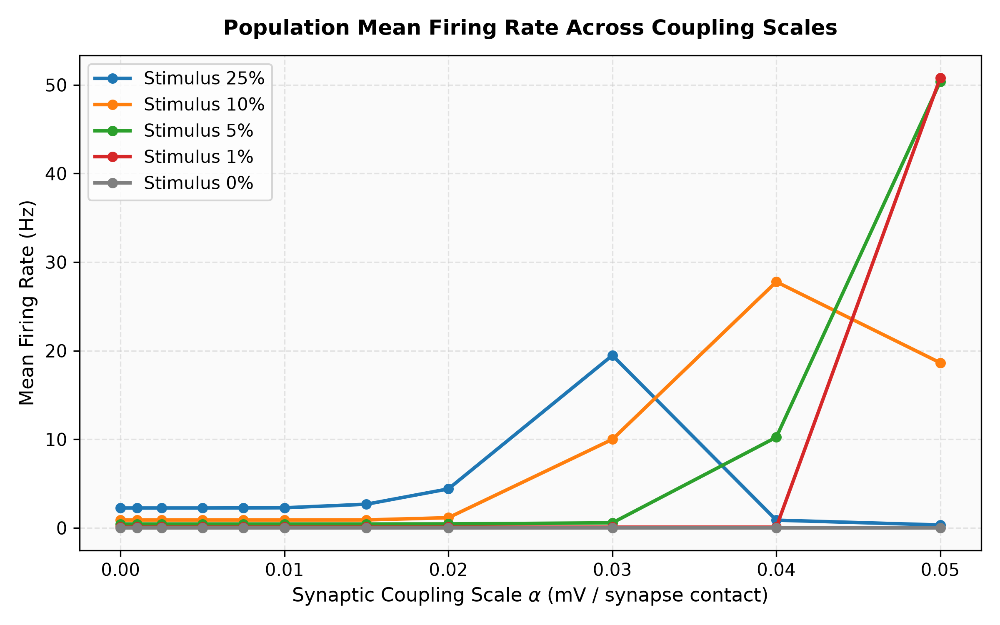
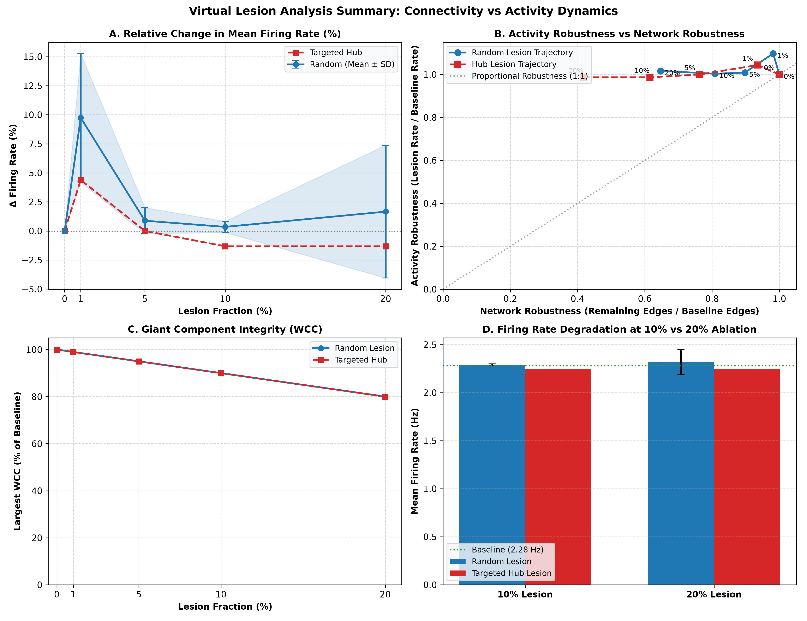
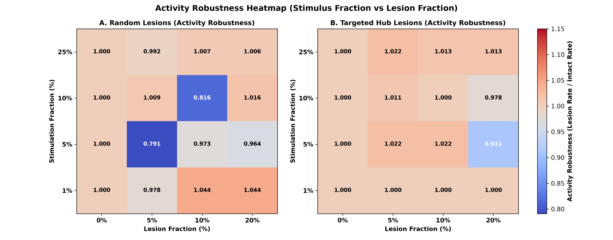
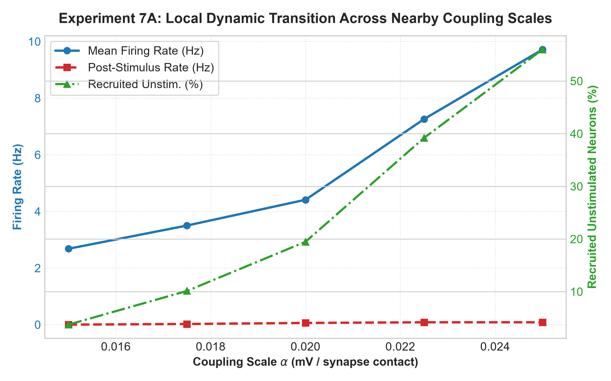
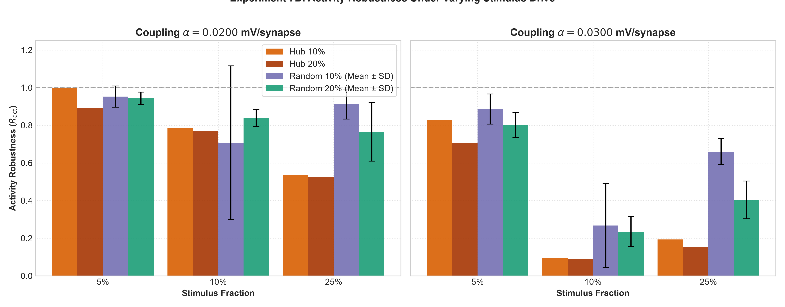
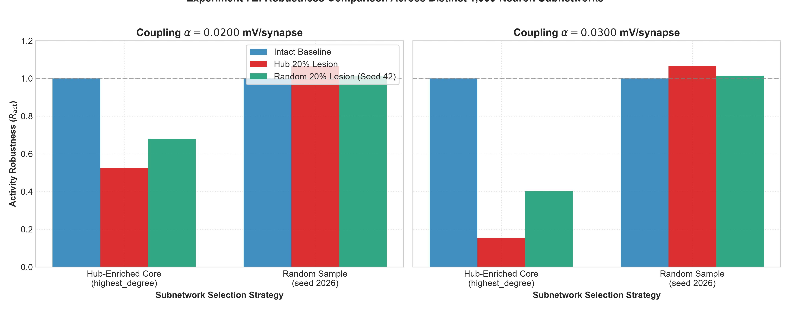

# Fly Connectome Research

[](https://www.python.org/)
[](tests/)
[](https://neuprint.janelia.org/)
[](https://creativecommons.org/licenses/by/4.0/)
[](docs/MODEL_ASSUMPTIONS.md)
[](docs/PHASE7_ROBUSTNESS_VALIDATION.md)
[](docs/RESEARCH_ROADMAP.md)

A rigorous, reproducible computational neurodynamics framework investigating how anatomical wiring topology, recurrent coupling scales, external stimulation volume, and targeted structural perturbations govern population activity and vulnerability in the *Drosophila melanogaster* (fruit fly) brain connectome.

---

## 📌 Table of Contents

- [Research Question](#-research-question)
- [Pipeline Architecture](#-pipeline-architecture)
- [Dataset & Biological Provenance](#-dataset--biological-provenance)
- [Computational Model](#-computational-model)
- [Experimental Phases](#-experimental-phases)
- [Key Scientific Findings & Figures](#-key-scientific-findings--figures)
  - [1. Connectome Topology & Degree Distribution](#1-connectome-topology--degree-distribution)
  - [2. Baseline Dynamics & Spiking Profiles](#2-baseline-dynamics--spiking-profiles)
  - [3. Coupling-Regime Sweep & Dynamic Transitions](#3-coupling-regime-sweep--dynamic-transitions)
  - [4. Virtual Lesion Analysis: Hub vs. Random Vulnerability](#4-virtual-lesion-analysis-hub-vs-random-vulnerability)
  - [5. Phase 7 Sensitivity & Robustness Validation](#5-phase-7-sensitivity--robustness-validation)
- [Repository Organization](#-repository-organization)
- [Reproducibility & Execution Guide](#-reproducibility--execution-guide)
- [Methodological Limitations](#-methodological-limitations)
- [Research Roadmap (Phase 8+)](#-research-roadmap-phase-8)
- [Contributing](#-contributing)
- [Citation & Provenance](#-citation--provenance)

---

## 🔬 Research Question

> **How do connectome topology, recurrent synaptic coupling strength, external stimulation volume, and targeted structural perturbations interact to determine dynamical activity, recruitment, and vulnerability in a connectome-constrained Leaky Integrate-and-Fire (LIF) network?**

Specifically, the project investigates:
1. Does the empirical Drosophila wiring diagram support self-sustained recurrent activity under point-LIF dynamics, or is activity predominantly feedforward-driven?
2. Are high-degree "hub" neurons disproportionately responsible for sustaining recurrent dynamics compared to random neuron populations?
3. How do external drive fractions, synaptic coupling scales, integration timesteps, and subnetwork sampling strategies modulate this vulnerability?

---

## ⚙ Pipeline Architecture

The experimental framework operates on a strict, memory-safe dataflow designed to run entirely on consumer hardware (Intel Core i5, 16 GB RAM) with sub-second simulation runtimes:

```mermaid
graph TD
    A[Janelia FlyEM Hemibrain v1.2.1<br/>4,259,624 Directed Connections<br/>data/raw/fly_hemibrain.csv.zip] -->|PyArrow Chunked Streaming| B[Standardized Parquet Store<br/>neurons.parquet & connections.parquet]
    B -->|Sampling Strategy: highest_degree| C[Primary 1,000-Neuron Subnetwork<br/>113,089 directed edges | rho=0.1132]
    C -->|Topological Diagnostics| D[In/Out Degree, Weight, Centrality<br/>real_connectome_summary.csv]
    C -->|LIF Model Integration| E[Vectorized LIF Simulation<br/>tau_m=20ms, dt=0.5ms, alpha=sweep]
    E -->|Pre / Stim / Post Windows| F[Dynamical Activity Profiles<br/>Firing Rates, Rasters, Heatmaps]
    C -->|Pure Functional Ablations| G[Virtual Lesion Operators<br/>Targeted Hub vs Random Deletions]
    G --> E
    E --> H[Phase 1-7 Validated Findings<br/>157 Sensitivity Runs | 64 Tests Passing]
```

---

## 🧠 Dataset & Biological Provenance

The project utilizes the **Janelia FlyEM Drosophila Hemibrain Connectome (v1.2.1)**:
- **Biological Scope**: Complete synaptic reconstruction of the central brain of an adult female *Drosophila melanogaster* (Scheffer et al., 2020), encompassing the central complex (CX), mushroom bodies (MB), antennal lobes (AL), and lateral horn (LH).
- **Scale**: 21,739 proofread neurons, 3,550,403 unique directed neuron-neuron connections, and 14,329,229 reconstructed synaptic contacts (presynaptic T-bars and postsynaptic densities [PSDs]).
- **Distribution**: Packaged in `data/raw/fly_hemibrain.csv.zip` (16.1 MiB compressed) and streamed into indexed Parquet tables (`data/processed/neurons.parquet` and `connections.parquet`).
- **Primary Subnetwork ($N = 1,000$)**:
  - Selection: `highest_degree` ($k_{\text{total}} = k_{\text{in}} + k_{\text{out}}$, seed 42).
  - Density: $\rho = 0.1132$ (113,089 directed edges, 937,685 anatomical synapses).
  - Average Degree: $\langle k \rangle = 226.18$, Maximum Degree: $k_{\max} = 924$.
  - Giant Component: Single weakly connected component ($100\%$ membership).

For full biological lineage and schema definitions, see [`data/DATA_PROVENANCE.md`](data/DATA_PROVENANCE.md).

---

## 📐 Computational Model

The network dynamics are modeled via vectorized **Leaky Integrate-and-Fire (LIF)** differential equations:

$$\tau_m \frac{dV_i(t)}{dt} = -(V_i(t) - V_{\text{rest}}) + R_m I_{\text{ext}, i}(t) + I_{\text{syn}, i}(t) + \xi_i(t)$$

When the membrane potential reaches threshold $V_{\text{threshold}}$, an action potential is registered and the potential is clamped to $V_{\text{reset}}$ for an absolute refractory period $t_{\text{ref}}$:

$$V_i(t) \ge V_{\text{threshold}} \implies S_i(t) = 1, \quad V_i(t^+) = V_{\text{reset}}$$

### Standardized Model Parameters

| Parameter | Symbol | Value | Unit | Biophysical / Computational Description |
| :--- | :---: | :---: | :---: | :--- |
| Membrane time constant | $\tau_m$ | $20.0$ | $\text{ms}$ | Passive leak membrane charging time |
| Resting potential | $V_{\text{rest}}$ | $-65.0$ | $\text{mV}$ | Baseline intracellular potential |
| Reset potential | $V_{\text{reset}}$ | $-70.0$ | $\text{mV}$ | Hyperpolarization voltage post-spike |
| Action potential threshold | $V_{\text{threshold}}$ | $-50.0$ | $\text{mV}$ | Depolarization threshold ($+15\,\text{mV}$ relative to rest) |
| Absolute refractory period | $t_{\text{ref}}$ | $2.0$ | $\text{ms}$ | Voltage clamp duration post-spike |
| Integration timestep | $dt$ | $0.5$ | $\text{ms}$ | Forward Euler numerical time resolution |
| External driving pulse | $I_{\text{ext}}$ | $18.0$ | $\text{mV}$ | Injected current during stimulus window $[200, 600]\,\text{ms}$ |
| Background membrane noise | $\sigma_{\text{noise}}$ | $1.0$ | $\text{mV}$ | Stochastic Gaussian current |
| Synaptic coupling scale | $\alpha$ | Varied | $\text{mV/synapse}$ | Effective postsynaptic jump per anatomical synapse |

> [!IMPORTANT]
> **Synaptic Scale ($\alpha$) Interpretation**: $\alpha$ is a computational model parameter ($\text{mV / synapse contact}$), **NOT an empirically calibrated biological quantal efficacy**. At presynaptic spike arrival, postsynaptic membrane potential instantaneously jumps by $\Delta V_i = \alpha \cdot W_{ji}\,\text{mV}$.

For mathematical derivations, see [`docs/MODEL_ASSUMPTIONS.md`](docs/MODEL_ASSUMPTIONS.md).

---

## 📊 Experimental Phases

| Phase | Title | Status | Scope & Key Results |
| :---: | :--- | :---: | :--- |
| **1** | Project Framework & Synthetic Validation | Complete | Validated pipeline architecture, data schemas, and graph algorithms on synthetic topologies. |
| **2** | Real Hemibrain Ingestion & Subnetwork Extraction | Complete | Ingested Hemibrain v1.2.1, performed streaming Parquet conversion, and isolated the 1,000-neuron hub core. |
| **3** | Baseline LIF Dynamics & Parameter Sweeps | Complete | Implemented vectorized LIF solver; mapped stable firing regimes ($\approx 2.28\,\text{Hz}$ at $\alpha = 0.01$). |
| **4** | Random vs. Targeted Hub Lesions | Complete | Simulated 1%, 5%, 10%, 20% deletions; showed apparent rate buffering under 25% external drive at $\alpha = 0.01$. |
| **5** | Stimulus-Fraction Robustness Matrix | Complete | 95 simulations sweeping drive (0–25%); revealed that rate buffering was driven by surviving-neuron normalization arithmetic ($N_{\text{surviving}}$). |
| **6** | Coupling-Regime Sweep & Dynamic Transitions | Complete | 55 intact simulations sweeping $\alpha \in [0, 0.05]$; identified transition to recurrent recruitment ($\alpha \ge 0.015$) and severe hub vulnerability at $\alpha = 0.030$. |
| **7** | Robustness & Sensitivity Validation | **Locked** | 157 simulations verifying local $\alpha$ continuity, stimulus fractions, lesion fraction scaling, timestep sensitivity, and subnetwork structure. |
| **8** | Topological Determinants of Lesion Sensitivity | Planned | Formal roadmap to isolate which centrality metrics ($k_{\text{in}}$, $k_{\text{out}}$, $s_{\text{total}}$, PageRank, betweenness) predict vulnerability using FDR-corrected nulls. |
| **9** | Density and Recurrence Scaling | Planned | Investigate recurrence onset across intermediate density levels ($\rho \in [0.01, 0.11]$) and rewired null models. |
| **10** | Anatomically Constrained / ROI Perturbations | Planned | Analyze structural vulnerabilities targeted to specific neuropil compartments (Mushroom Body, Central Complex, Antennal Lobe). |

---

## 📈 Key Scientific Findings & Figures

### 1. Connectome Topology & Degree Distribution
The primary 1,000-neuron subnetwork represents a dense, heavy-tailed integrator core with broad degree distributions:


*Figure 1: In-degree, out-degree, total degree, and edge weight distributions of the primary 1,000-neuron Janelia Hemibrain subnetwork.*

---

### 2. Baseline Dynamics & Spiking Profiles
Under baseline parameters ($\alpha = 0.01\,\text{mV/synapse}$, $25\%$ stimulus pulse $t \in [200, 600]\,\text{ms}$), stimulated neurons fire regularly while unstimulated neurons remain subthreshold:


*Figure 2: Baseline spike raster plot demonstrating sparse, stimulus-locked firing across the 1,000-neuron network.*

---

### 3. Coupling-Regime Sweep & Dynamic Transitions
Sweeping the synaptic coupling scale $\alpha$ across 11 values reveals three distinct dynamic regimes:
1. **Low-Coupling Regime ($\alpha \le 0.010\,\text{mV/syn}$)**: Activity is purely feedforward; unstimulated recruitment is near zero ($< 1\%$), and post-stimulus activity ceases immediately ($0\,\text{Hz}$).
2. **Transition / Recurrent-Recruitment Regime ($\alpha \approx 0.015–0.030\,\text{mV/syn}$)**: Recurrent connectivity amplifies firing, recruits up to $87.1\%$ of unstimulated neurons, and sustains reverberant post-stimulus activity ($1.56\,\text{Hz}$).
3. **Numerically Unstable Regime ($\alpha \ge 0.040\,\text{mV/syn}$)**: Unconstrained positive feedback produces membrane explosion ($> 120\,\text{mV}$) in the excitatory-only model.


*Figure 3: Observed activity regimes across coupling scales showing feedforward dominance, recurrent amplification, and numerical instability.*


*Figure 4: Population mean firing rate as a function of coupling scale $\alpha$ across 5 external drive levels.*

---

### 4. Virtual Lesion Analysis: Hub vs. Random Vulnerability
In the recurrent regime ($\alpha = 0.030$), targeted high-degree hub removal produces catastrophic functional collapse compared to size-matched random ablation:
- A **10% hub lesion** reduces activity robustness to **$R_{\text{act}} = 0.1935$** (an $80.6\%$ reduction), decimating recruited unstimulated neurons from $653 \to 92$.
- In contrast, a **20% random lesion** preserves substantially more activity (**$R_{\text{act}} = 0.4030 \pm 0.0881$**, retaining $299 \pm 83$ recruited neurons).


*Figure 5: Comparison of functional firing rate loss, active fraction collapse, and structural disconnection between hub and random lesions.*


*Figure 6: 2D heatmap showing activity robustness across stimulus levels and lesion severities.*

---

### 5. Phase 7 Sensitivity & Robustness Validation
Phase 7 systematically validated the core conclusions across 157 simulations:

#### A. Local $\alpha$ Continuity
Recruitment and firing rate increase monotonically around $\alpha = 0.0200$, confirming that $\alpha = 0.0200$ is a representative point within a continuous transition region rather than an isolated mathematical threshold:


*Figure 7: Measured continuous scaling of mean firing rate, recruitment, and maximum voltage across closely spaced $\alpha$ values.*

#### B. External Drive Fraction Sensitivity
Whenever external stimulation recruits recurrent activity ($\ge 10\%$), targeted hub lesions consistently cause substantially greater functional collapse than random deletions:


*Figure 8: Activity robustness across external drive fractions under hub and random lesions at $\alpha = 0.020$ and $\alpha = 0.030$.*

#### C. Subnetwork Structure Contrast
At identical coupling strengths ($\alpha = 0.020$ and $0.030$), strong recurrent recruitment and hub-lesion sensitivity were observed in the primary degree-enriched core ($\rho = 0.1132$), but not in a randomly sampled subnetwork ($\rho = 0.0073$, seed 2026), which remains feedforward-dominated:


*Figure 9: Firing rate and recruitment comparison between the hub-enriched core and a randomly sampled subnetwork.*

---

## 📁 Repository Organization

```
fly-connectome-research/
├── configs/               # Model configuration YAMLs
│   └── default.yaml       # Default LIF parameters, seeds, and paths
├── data/                  # Connectome dataset specifications & provenance
│   ├── raw/               # Downloaded raw archives (fly_hemibrain.csv.zip)
│   ├── processed/         # Processed Parquet tables (neurons.parquet & connections.parquet)
│   ├── DATA_PROVENANCE.md # Lineage, licenses, and schema definitions
│   └── README.md          # Data ingestion and Parquet conversion guide
├── docs/                  # In-depth scientific experiment documentation
│   ├── MODEL_ASSUMPTIONS.md           # Equations, parameters, and boundary conditions
│   ├── LESION_EXPERIMENT.md           # Phase 4 design, protocols, and metrics
│   ├── STIMULUS_ROBUSTNESS_EXPERIMENT.md # Phase 5 stimulus decoupling analysis
│   ├── COUPLING_REGIME_EXPERIMENT.md  # Phase 6 coupling sweep and regime definitions
│   ├── PHASE7_ROBUSTNESS_VALIDATION.md# Phase 7 sensitivity analysis & accounting
│   └── RESEARCH_ROADMAP.md            # Research plan for Phase 8, 9, 10, and beyond
├── experiments/           # Standalone, reproducible experiment execution scripts
│   ├── 01_connectome_exploration.py   # Phase 2: Ingestion & topological diagnostics
│   ├── 02_baseline_simulation.py       # Phase 3: Baseline LIF simulation & sweeps
│   ├── 03_lesion_experiments.py       # Phase 4: Hub vs. random lesion experiments
│   ├── 04_stimulus_robustness.py      # Phase 5: Stimulus-fraction matrix (95 runs)
│   ├── 05_coupling_sweep.py           # Phase 6: Coupling-regime sweep & validation
│   └── 06_phase7_robustness.py        # Phase 7: Robustness & sensitivity (157 runs)
├── results/               # Frozen experimental outputs
│   ├── figures/           # 30 publication-quality figures (.png)
│   ├── tables/            # 17 locked numerical result CSVs
│   └── logs/              # Execution manifests and run logs
├── scratch/               # Independent reproducibility verification scripts
│   ├── verify_coupling_reproducibility.py
│   ├── verify_lesion_reproducibility.py
│   ├── verify_phase7_reproducibility.py
│   └── summarize_phase7.py
├── src/                   # Core modular Python package
│   ├── data_loader.py     # Streaming Parquet conversion & validation
│   ├── graph_builder.py   # NetworkX directed graph construction
│   ├── neuron_selection.py# Subnetwork extraction (highest_degree, random)
│   ├── simulation.py      # Vectorized LIF numerical integrator
│   └── lesion.py          # Pure functional graph lesion operators
├── tests/                 # Complete unit test suite (64 unit tests)
├── CONTRIBUTING.md         # Guidelines for community contributions and research rules
├── requirements.txt       # Minimal, pinned Python dependencies
└── README.md              # Top-level research guide
```

---

## 💻 Reproducibility & Execution Guide

### 1. Installation

```powershell
# Clone repository
git clone https://github.com/alok-108/fly-connectome-research.git
cd fly-connectome-research

# Create and activate virtual environment
python -m venv .venv
.\.venv\Scripts\Activate.ps1    # On Windows
# source .venv/bin/activate     # On Linux/macOS

# Install dependencies
python -m pip install --upgrade pip
python -m pip install -r requirements.txt
```

### 2. Run Test Suite
Confirm all 64 unit tests pass:
```powershell
pytest -v
```

### 3. Verify Exact Numerical Reproducibility
Rerun deterministic subsets to verify exact bitwise reproducibility against locked CSVs:
```powershell
python scratch/verify_phase7_reproducibility.py
```

### 4. Running Experiments
All experiments utilize deterministic seeds (`seed=42`):
```powershell
# Phase 2: Ingestion & Topology Diagnostics
python experiments/01_connectome_exploration.py --neurons 1000 --strategy highest_degree --seed 42

# Phase 3: Baseline LIF Simulation
python experiments/02_baseline_simulation.py --neurons 1000 --duration 1000 --dt 0.5 --weight-scale 0.01 --stimulus pulse --seed 42

# Phase 4: Virtual Lesion Analysis
python experiments/03_lesion_experiments.py --neurons 1000 --seed 42

# Phase 5: Stimulus Robustness (95 runs)
python experiments/04_stimulus_robustness.py --seed 42

# Phase 6: Coupling-Regime Sweep (55 intact + 36 lesion runs)
python experiments/05_coupling_sweep.py --seed 42

# Phase 7: Robustness & Sensitivity Validation (157 runs)
python experiments/06_phase7_robustness.py
```

---

## ⚠️ Methodological Limitations

1. **Excitatory Point-LIF Simplification**: All connectome synapses are modeled as positive depolarizing inputs; neurotransmitter identity (GABAergic, glutamatergic, cholinergic) and opposing inhibitory networks are omitted. High coupling regimes therefore induce runaway excitation.
2. **Computational Coupling Scale**: The coupling parameter $\alpha$ represents an instantaneous potential jump ($\text{mV / synapse contact}$), rather than an in vivo biophysically grounded conductance with dynamic reversal potentials and kinetic filtering.
3. **Core-Periphery Subnetwork Bias**: The 1,000-neuron subnetwork is heavily enriched for high-degree central brain integration hubs. Findings must not be generalized to sparse peripheral or feedforward circuits.
4. **Static Anatomy vs. Physiological Function**: EM connectomes measure physical synapse contacts. Physiological functional connectivity depends on receptor subtypes, modulatory states, and internal dynamics.
5. **No Behavioral Equivalence**: Firing rate stability or collapse reflects computational properties of point-LIF network dynamics, not behavioral phenotypes in living *Drosophila*.

---

## 🗺 Research Roadmap (Phase 8+)

Future research directions are formally codified in [`docs/RESEARCH_ROADMAP.md`](docs/RESEARCH_ROADMAP.md):

- **Phase 8: Topological Determinants of Lesion Sensitivity**:
  - Test which graph centrality metrics ($k_{\text{in}}$, $k_{\text{out}}$, $s_{\text{total}}$, PageRank, betweenness) predict computational vulnerability in the recurrent regime ($\alpha = 0.030$).
  - Evaluate size-matched and degree-matched null controls with Benjamini–Hochberg False Discovery Rate (FDR) correction.
- **Phase 9: Density & Recurrence Scaling**:
  - Analyze recurrent recruitment thresholds across intermediate density levels ($\rho \in [0.01, 0.11]$) and degree-preserving rewired null models.
- **Phase 10: Anatomically Constrained / ROI-Specific Perturbations**:
  - Evaluate regional perturbations targeted to specific neuropil compartments (Mushroom Body, Central Complex, Antennal Lobe).
- **Long-Term Model Extensions**:
  - Balanced excitation/inhibition ($E/I$), conductance-based kinetics, conduction delays, and whole-brain GPU scaling.

---

## 🤝 Contributing

We welcome community feedback and collaboration! Please review [`CONTRIBUTING.md`](CONTRIBUTING.md) for contribution guidelines, code standards, and the scientific freeze protocol for Phases 1–7.

---

## 📜 Citation & Provenance

### Dataset Citations
- **Janelia FlyEM Hemibrain Connectome (v1.2.1)**:
  - Scheffer, L. K., Xu, C. S., Januszewski, M., Lu, Z., Takemura, S., Hayworth, K. J., ... & Plaza, S. M. (2020). *A connectome and analysis of the adult Drosophila central brain*. **eLife**, 9, e57443. [DOI: 10.7554/eLife.57443](https://doi.org/10.7554/eLife.57443).
  - Open Access under [Creative Commons Attribution 4.0 International (CC BY 4.0)](https://creativecommons.org/licenses/by/4.0/).
  - neuPrint access: [https://neuprint.janelia.org/](https://neuprint.janelia.org/).
- **Data Mirror**:
  - Netzschleuder network catalogue (curated by Dr. Tiago Peixoto): [https://networks.skewed.de/net/fly_hemibrain](https://networks.skewed.de/net/fly_hemibrain).

### Software Tools
- Python 3.13, NumPy, SciPy, Pandas, PyArrow, NetworkX, Matplotlib, Seaborn, Pytest, PyYAML.
