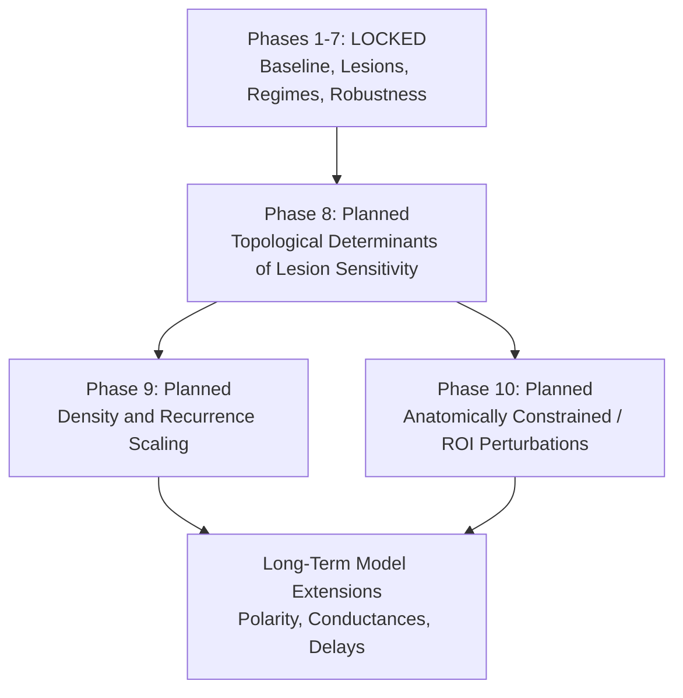

# Research Roadmap

> **Status Notice:** Phases 1–7 are completed and locked. Future phases are planned research directions and have not yet been executed unless explicitly marked otherwise.

---

## Overview & Progression Architecture

The Fly Connectome Research project investigates how empirical connectome topology, recurrent synaptic coupling, external stimulation, and targeted structural perturbations govern dynamics in a connectome-constrained Leaky Integrate-and-Fire (LIF) network.

Having established the baseline model, coupling regimes, and sensitivity profiles across Phases 1–7, this document defines the formal research roadmap for subsequent investigations.

---

## Phase 8: Topological Determinants of Lesion Sensitivity

### Primary Research Question
> **Among highly connected neurons in the degree-enriched Hemibrain subnetwork, which measurable topological property best predicts functional vulnerability to node removal under recurrent LIF dynamics?**

### Framing and Terminology
This inquiry investigates computational vulnerability and structural correlates within a parameterized point-neuron simulation. Findings will be framed in terms of:
- **Association**,
- **Predictive relationship**,
- **Structural correlates**, and
- **Computational vulnerability**,

rather than *biological cause*, *in vivo mechanisms*, or *proof that hub neurons are biologically vital*.

---

### Sub-Phase 8A: Topology Characterization
Prior to executing perturbation simulations, structural metric distributions will be computed across the primary 1,000-neuron subnetwork to determine whether "hub" neurons represent a single homogeneous population or distinct structural sub-classes:

1. **Evaluated Topological Metrics:**
   - **In-Degree ($k_{\text{in}}$)**: Number of presynaptic partners.
   - **Out-Degree ($k_{\text{out}}$)**: Number of postsynaptic targets.
   - **Total Degree ($k_{\text{total}} = k_{\text{in}} + k_{\text{out}}$)**.
   - **In-Weight ($s_{\text{in}}$)**: Total incoming reconstructed synaptic contacts (PSDs).
   - **Out-Weight ($s_{\text{out}}$)**: Total outgoing reconstructed synaptic contacts.
   - **Total Synaptic Weight ($s_{\text{total}} = s_{\text{in}} + s_{\text{out}}$)**.
   - **PageRank Centrality**: Random-walk structural centrality on directed graph.
   - **Betweenness Centrality**: Fraction of all shortest paths passing through a node.

2. **Pre-Lesion Analyses:**
   - Distribution profiling (skewness, heavy-tail diagnostics).
   - Pairwise metric correlation matrices (Pearson and Spearman rank correlations).
   - Top-$k$ rank overlap analysis (for $k \in \{50, 100, 200\}$).
   - Jaccard set overlap ($J(A, B) = |A \cap B| / |A \cup B|$) across top-ranked subsets.

**Objective:** Establish the empirical collinearity or independence among structural candidate targets before running dynamical simulations.

---

### Sub-Phase 8B: Targeted Lesion Comparison
Simulate targeted node removals using the candidate topological strategies identified in Phase 8A within the validated recurrent regime:

- **Simulation Regime:**
  - Synaptic coupling scale: $\alpha = 0.030\,\text{mV / synapse contact}$ (empirically validated recurrent regime with active recruitment).
  - External drive: $25\%$ ($250$ neurons), pulse window $200–600\,\text{ms}$ ($I_{\text{ext}} = 18.0\,\text{mV}$).
  - Simulation duration: $T = 1,000\,\text{ms}$, timestep $dt = 0.5\,\text{ms}$.
- **Targeting Strategies:**
  1. High in-degree ($k_{\text{in}}$)
  2. High out-degree ($k_{\text{out}}$)
  3. High total synaptic weight ($s_{\text{total}}$)
  4. High PageRank
  5. High betweenness centrality
  6. Uniform random deletion (size-matched baseline controls across 5+ random seeds)
- **Lesion Severities:**
  - $10\%$ ($100$ neurons ablated)
  - $20\%$ ($200$ neurons ablated)

---

### Sub-Phase 8C: Stimulus Robustness
If Sub-Phase 8B reveals meaningful topology-dependent differences in activity reduction:
- Re-evaluate the most informative targeting strategies at:
  - $10\%$ external stimulation ($100$ neurons driven), and
  - $25\%$ external stimulation ($250$ neurons driven).
- This avoids unnecessary combinatorial explosion while determining whether topological vulnerabilities depend on the volume of direct external drive.

---

### Sub-Phase 8D: Matched Null Controls
To determine whether observed vulnerability is uniquely associated with a specific topological metric or merely reflects generic high connectivity:
- For the most vulnerable topological metric identified:
  - Construct size-matched and approximately degree-matched random control sets.
  - Implement degree-binned stratified sampling (selecting control nodes with comparable total degree distributions).
- **Constant Control Invariants:**
  - Identical lesion size ($N_{\text{lesion}}$).
  - Identical pre-lesion stimulus selection set.
  - Identical coupling scale ($\alpha = 0.030\,\text{mV/synapse}$).
  - Identical physical simulation duration ($1,000\,\text{ms}$) and timestep ($dt = 0.5\,\text{ms}$).
  - Standardized pseudo-random generator seeds.

**Goal:** Establish whether specific graph centrality metrics impart computational vulnerability beyond degree alone.

---

## Statistical Plan for Phase 8

1. **Primary Response Variables:**
   - **Activity Robustness:**
     $$R_{\text{act}} = \frac{\bar{\nu}_{\text{lesion}}}{\bar{\nu}_{\text{intact}}}$$
   - **Activity Reduction:**
     $$\Delta R = 1 - R_{\text{act}}$$
   - **Recruited Unstimulated Neurons:** Count and fraction of unstimulated neurons firing $\ge 1$ spike.
   - **Post-stimulus Reverberation Rate:** Mean firing rate in $t \in [600, 1000]\,\text{ms}$.

2. **Planned Statistical Procedures:**
   - Descriptive summary statistics (mean, median, standard deviation, interquartile range).
   - Empirical bootstrap confidence intervals (95% CI) for mean random controls.
   - Spearman rank correlation ($\rho$) between node topological rank and individual post-lesion impact.
   - Standardized effect sizes (Cohen's $d$ or Cliff's delta) between targeted strategies and random distributions.
   - Permutation-based null testing against degree-matched distributions.
   - **Multiple Testing Correction:** Benjamini–Hochberg False Discovery Rate (FDR, $q < 0.05$) applied across family-wise metric comparisons.

> [!NOTE]
> Statistical significance must not be asserted or claimed until Phase 8 simulations are formally executed and logged.

---

## Phase 9: Density and Recurrence Scaling

### Primary Research Question
> **How does network density or degree structure influence the transition from externally driven activity to recurrently recruited activity?**

Phase 7E demonstrated that at identical coupling strengths ($\alpha = 0.020$ and $0.030$), the primary degree-enriched subnetwork ($\rho = 0.1132$, $\langle k \rangle = 226$) exhibits strong recurrent amplification, whereas a randomly sampled subnetwork ($\rho = 0.0073$, $\langle k \rangle = 14.6$) remains feedforward-dominated.

### Planned Methodological Approaches (Future Work):
1. **Intermediate Subnetwork Sampling:**
   - Construct subnetworks with controlled intermediate densities ($\rho \in [0.01, 0.03, 0.05, 0.08]$).
2. **Top-$K$ Subnetwork Extraction:**
   - Evaluate subnetwork sizes $N \in [500, 1000, 2000, 5000]$ to assess scaling effects.
3. **$k$-Core Decomposition:**
   - Extract subgraphs across progressive $k$-shell thresholds to isolate structural core transitions.
4. **Degree-Preserving Rewired Null Models:**
   - Implement Maslov–Sneppen edge-swapping algorithms to preserve in/out-degree sequences while disrupting higher-order clustering and modular organization.
   - Test whether recurrent recruitment requires specific connectome motifs or merely degree density.

---

## Phase 10: Anatomically Constrained / ROI-Specific Perturbations

### Primary Research Question
> **Do virtual lesions targeted to specific anatomical neuropil compartments produce differential computational vulnerability compared to whole-brain topological deletions?**

### Planned Compartments (Available in Janelia Hemibrain v1.2.1 Annotations):
- **Mushroom Body (MB):** Learning, associative memory, and olfactory integration (Kenyon cells, MBONs, DANs).
- **Central Complex (CX):** Spatial navigation, ring-attractor head direction, and motor coordination (EB, PB, FB, NO).
- **Antennal Lobe (AL):** Primary olfactory sensory processing and projection neurons.
- **Lateral Horn (LH):** Innate olfactory processing and behavioral valence circuits.

### Important Modeling Limitations for Phase 10:
- The present model represents all connections as excitatory point-LIF inputs and omits inhibitory neurotransmission (e.g. GABAergic APL neurons in MB), neuromodulatory tone (dopaminergic/octopaminergic signaling), and multi-compartment cable attenuation.
- Therefore, future ROI-targeted perturbation experiments will be formulated as **structural/computational perturbation analyses** evaluating how regional connectivity patterns govern network vulnerability, rather than direct assertions regarding fly behavioral phenotypes.

---

## Future Model Extensions (Long-Term Horizon)

Longer-term research directions include upgrading the biophysical representation:
1. **Inhibitory and Excitatory Polarity:**
   - Integrate neurotransmitter predictions (acetylcholine $\to$ excitation; GABA/glutamate $\to$ inhibition) from FlyWire and Hemibrain annotations to study balanced network regimes ($E/I$ balance).
2. **Conductance-Based Synaptic Dynamics:**
   - Implement conductance-based synapses with finite rise and decay kinetics ($\tau_{\text{rise}}, \tau_{\text{decay}}$) and reversal potentials ($E_{\text{rev}}$).
3. **Axonal and Synaptic Propagation Delays:**
   - Incorporate distance- or compartment-dependent conduction delays ($\Delta t_{ij} \in [1, 5]\,\text{ms}$) to investigate phase synchronization and oscillatory dynamics.
4. **Heterogeneous Neuronal Properties:**
   - Assign cell-type specific resting potentials, thresholds, and membrane time constants calibrated against recorded *Drosophila* electrophysiology.
5. **Scale Up to Whole-Brain Simulations:**
   - Transition from 1K subnetwork to full Hemibrain ($21.7\text{K}$) and whole-brain FlyWire ($139\text{K}$) using sparse GPU tensor implementations (`torch.sparse_coo_tensor`).

---

## Scientific Claims & Interpretation Policy

To maintain rigorous scientific fidelity, this repository enforces a strict four-level conceptual separation:

| Category | Definition | Scientific Scope |
| :--- | :--- | :--- |
| **1. Measured Computational Results** | Numerical outputs, spike counts, firing rates, and graph metrics generated by simulation code. | Strictly factual and deterministic under specified seeds and parameters. |
| **2. Model-Dependent Interpretations** | Conclusions regarding how the parameterized LIF model behaves on the graph. | Valid strictly within the boundary conditions of the simulated model. |
| **3. Biological Hypotheses** | Plausible conjectures about biological brain organization suggested by model trends. | Untested hypotheses requiring experimental validation in living organisms. |
| **4. Future Research Questions** | Formal inquiries planned for subsequent phases. | Proposed workflows with no assumed outcomes. |

### Concrete Phrasing Examples:

- ❌ **Unacceptable (Overclaiming):**
  > "Hub neurons are biologically essential to the fruit fly."
- ✅ **Acceptable (Model-Scoped):**
  > "Within the tested connectome-constrained LIF model, targeted removal of high-degree neurons produced larger reductions in simulated activity than random removal."

- ❌ **Unacceptable (Overclaiming):**
  > "$\alpha = 0.020$ is the critical threshold of the fly brain."
- ✅ **Acceptable (Model-Scoped):**
  > "$\alpha = 0.020$ lies within the transition region observed in the tested model parameter sweep."

- ❌ **Unacceptable (Overclaiming):**
  > "The mushroom body controls network resilience."
- ✅ **Acceptable (Model-Scoped):**
  > "Future experiments will test whether structurally defined neuropil-specific perturbations produce different responses in this model."

- ❌ **Unacceptable (Overclaiming):**
  > "Network firing rate is invariant to integration timestep."
- ✅ **Acceptable (Model-Scoped):**
  > "The qualitative ordering of hub versus random lesion effects was preserved across tested timesteps, although absolute firing rates showed timestep dependence."
